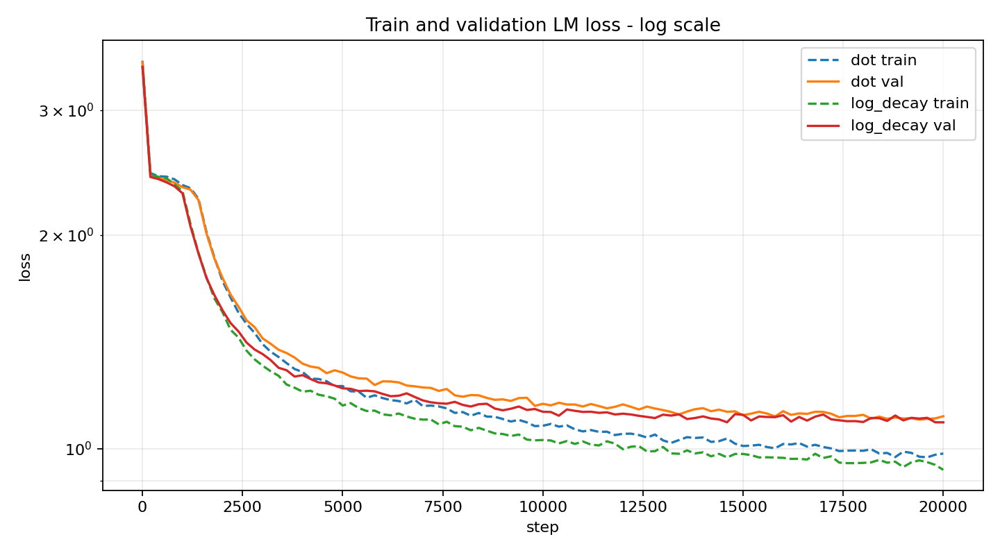
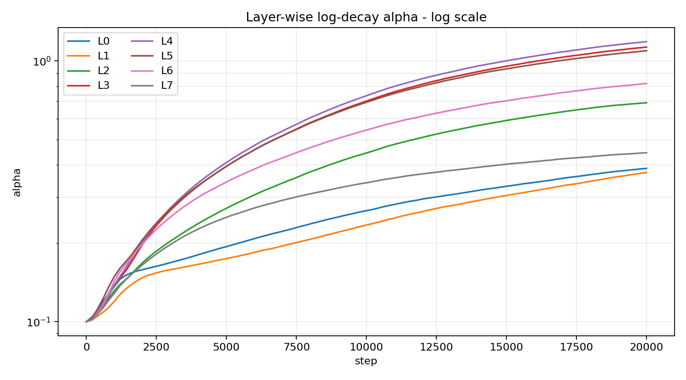
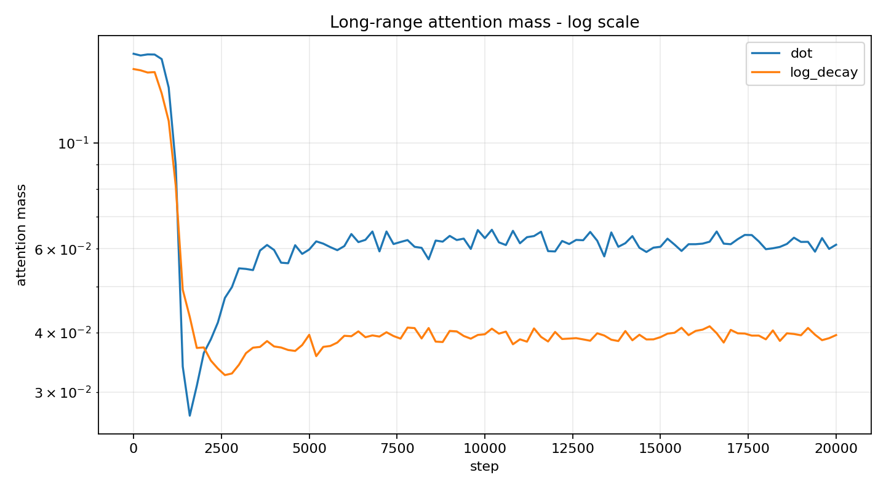

# log_attention

`log_attention` is a compact PyTorch character-language-modeling experiment comparing ordinary causal dot-product attention against a learned log-decayed causal attention mechanism.

The core idea: standard causal attention lets every previous token compete using content similarity alone. The log-decay variant keeps that content score but subtracts a **learned per-head distance tax** that grows logarithmically with token age. Nearby tokens have a structural advantage by default, but important distant tokens can still win by being content-strong enough to overcome the tax.

The main script trains a small GPT-style character model on `input.txt`, runs dot and log_decay models side-by-side on identical batches, saves best checkpoints, logs detailed metrics to CSV, generates samples during training, creates post-training diagnostic plots, and renders an attention-evolution video.

The repository is intentionally small:

```text
.
├── input.txt
├── train.py
├── LICENSE
└── README.md
```

## What It Does

The experiment asks a simple question:

Can a transformer keep useful long-range context while applying an explicit learned penalty to older tokens?

The novelty is not in the components but in their combination: a **learned, multiplicative power-law distance prior** applied per-head, on top of standard dot-product attention. This is different from:

- **Relative position encodings** (Shaw et al., 2018): add learned embeddings per distance — log-decay uses one scalar per head, no embedding table.
- **ALiBi** (Press et al., 2021): a fixed non-learned linear bias — log-decay is learned and nonlinear.
- **Sliding window attention**: hard-restricts the span — log-decay never restricts, only taxes.
- **Low-rank / sparse approximations**: change what can be attended to — log-decay keeps full dense attention and modulates it.

The `(1 + distance)^(-alpha)` form is theoretically motivated by power-law distributions observed in natural language (Zipf's law). And because alpha is **per-head and learned**, different layers autonomously discover different optimal attention spans — early layers often learn weak decay (preserve broad context), middle layers often learn strong decay (local composition), and the final layer often relaxes again (needs range for output).

The script supports three modes:

| Mode | Behavior |
| --- | --- |
| `dot` | Train only the standard causal attention model. |
| `log_decay` | Train only the log-decayed attention model. |
| `all` | Train both models side by side on the same batches. |

By default, the script runs in `all` mode, enabling a clean controlled comparison where both models see identical data batches in identical order. Most configuration lives in the `config` dictionary near the top of `train.py`.

## Quick Start

Install the runtime dependencies:

```bash
python3 -m pip install torch matplotlib
```

Then run training:

```bash
python3 train.py
```

The script automatically selects the best available device:

1. CUDA, if available
2. Apple MPS, if available
3. CPU fallback

Training reads from `input.txt`. Replace that file with any plain-text corpus you want to model.

## Configuration

Open `train.py` and edit the `config` dictionary.

Important fields:

| Field | Meaning |
| --- | --- |
| `input_path` | Path to the text corpus. |
| `val_frac` | Fraction of the corpus reserved for validation. |
| `block_size` | Context length visible to the student model. |
| `batch_size` | Number of sequences per training batch. |
| `max_steps` | Number of optimizer steps. |
| `eval_interval` | How often to evaluate, sample, log metrics, and capture attention snapshots. |
| `n_layer` | Number of transformer blocks. |
| `n_head` | Number of attention heads. |
| `n_embd` | Embedding width. |
| `attention_method` | `dot`, `log_decay`, or `all`. |
| `decay_alpha_init` | Initial learned decay strength. |
| `decay_alpha_scale` | Scale applied after `softplus` to produce alpha. |
| `use_self_distill` | Enables EMA-teacher self-distillation. |
| `enable_post_training_plots` | Saves post-training PNG plots. |
| `enable_attention_video` | Saves the side-by-side attention evolution video. |
| `attention_video_max_rows` | Wraps layer heatmaps into more columns after this many rows. Defaults to `2` for a horizontal desktop layout. |
| `attention_video_max_heatmap_size` | Display-only cap for attention heatmap resolution in the video. |

For most first runs, keep `attention_method="all"` so the standard and log-decay models are trained under matching conditions.

## Outputs

Training writes artifacts under `checkpoints_log_decay/`.

```text
checkpoints_log_decay/
├── metrics.csv
├── dot_best.pt
├── log_decay_best.pt
├── attention_evolution.mp4
└── plots/
    ├── 01_train_val_lm_loss.png
    ├── 02_val_loss_delta.png
    ├── 03_best_val_lm.png
    ├── 04_alpha_evolution.png
    ├── 05_layerwise_alpha.png
    ├── 06_long_range_attention_mass.png
    ├── 07_mean_attention_distance.png
    ├── 08_val_loss_vs_attention_distance.png
    └── 09_best_val_lm_bar.png
```

Generated checkpoints and plots are ignored by Git so experiments do not bloat the repository.

## Plots

At the end of training, `train.py` reads `metrics.csv` and creates nine plots.

| Plot | Purpose |
| --- | --- |
| Train/validation LM loss | Shows optimization and generalization over time. |
| Validation loss delta | Shows `log_decay - dot`; values below zero favor log-decay. |
| Best validation LM loss | Shows checkpoint quality over time. |
| Alpha evolution | Shows how the learned decay strength changes. |
| Layer-wise alpha | Shows whether different layers learn different decay behavior. |
| Long-range attention mass | Tracks attention assigned to older tokens. |
| Mean attention distance | Tracks the average attended distance. |
| Val loss vs attention distance | Relates attention behavior to validation quality. |
| Best validation bar chart | Summarizes final best validation loss by model. |

## Attention Evolution Video

When `enable_attention_video=True`, the script captures a fixed validation probe at every eval interval. For each model and each layer, it averages attention over batch and heads and stores a layer-level attention matrix.

After training, those snapshots become:

```text
checkpoints_log_decay/attention_evolution.mp4
```

The video layout is:

- rows: transformer layers, wrapped after `attention_video_max_rows` to favor a horizontal desktop layout
- columns: trained attention methods and wrapped layer groups
- frames: evaluation steps

For larger contexts, heatmaps are average-pooled for display to at most `attention_video_max_heatmap_size` pixels per side. This keeps 512+ token attention maps readable on a desktop screen without changing the captured model diagnostics or training.

This makes it easier to inspect whether the log-decay model merely changes loss, or actually learns a different attention geometry over time.

If `ffmpeg` is not available, the script falls back to a GIF.

## Checkpoints

Whenever validation loss improves, the script saves a best checkpoint for that model:

```text
checkpoints_log_decay/dot_best.pt
checkpoints_log_decay/log_decay_best.pt
```

Each checkpoint contains:

- model weights
- config
- vocabulary size
- character-to-index mapping
- index-to-character mapping
- step number
- best validation statistics

## Self-Distillation

The script includes an optional self-distillation path controlled by `use_self_distill=True`. It combines three mechanisms:

**1. Privileged prefix.** The teacher sees a longer context than the student (by default, 256 extra tokens via `hint_len`). The student predicts tokens that the teacher conditioned on with more history. The teacher has a structural advantage without being a different architecture.

**2. EMA teacher.** The teacher is a slow exponential-moving-average copy of the student itself (`ema_decay=0.995`). It is not separately trained — it tracks the student's own improving predictions, making it a smoothed, ensemble-like target.

**3. Entropy-filtered KL.** The student loss is:
```
L = L_CE + 0.15 * L_KD
```
where `L_KD` is only applied at positions where the teacher's prediction entropy is lower than the student's by more than 0.05 nats. This means distillation only activates where the teacher is demonstrably more confident — avoiding "the blind leading the blind."

The hypothesis tested by self-distillation: **can the student internalize the benefit of seeing further back, without actually needing that context at inference time?**

This is off by default (`use_self_distill=False`). Enable it when specifically testing context compression.

## Practical Notes

This is a character-level model, so it can train on arbitrary text without a tokenizer. That keeps the experiment easy to run and inspect, but it also means losses are character-level losses, not token-level losses from a modern subword tokenizer.

The default model is intentionally small enough for local experimentation, but side-by-side training with `attention_method="all"` doubles the model work. If training is slow, reduce:

- `n_embd`
- `n_layer`
- `n_head`
- `block_size`
- `batch_size`
- `max_steps`

For faster artifact generation while testing the plotting pipeline, lower `max_steps` and `eval_interval`.

## Reproducibility

The script sets:

```python
torch.manual_seed(config["seed"])
```

This improves repeatability, but exact results can still differ by device, PyTorch backend, and nondeterministic kernels.

## Results

The main control study runs both models side-by-side for 20,000 steps on a Harry Potter corpus (~5M training tokens). Key findings:

| Metric | DOT | LOG_DECAY |
|---|---|---|
| Best validation loss | 1.0986 | **1.0890** |
| Long-range attention mass | 6.19% | **3.94%** |
| Per-head alpha @ 20k | — | 0.37–1.19 (layer-dependent) |

Log-decay wins at **91% of late-stage evaluations** (steps 5000–20000), with a mean delta of **-0.026 nats** in favor of log-decay. The gap widens at higher steps rather than closing, suggesting the advantage compounds with training.

The most striking result is **alpha specialization by layer.** The model discovers that early layers (L0, L1) benefit from weak decay (alpha ≈ 0.37), middle layers (L4, L5) benefit from strong decay (alpha ≈ 1.13–1.19), and the final layer relaxes again (alpha ≈ 0.82). This emergent structure matches intuition about what different transformer layers do — early layers extract local features, middle layers compose them, and the final layer needs range to produce coherent output.

Critically, log-decay achieves better perplexity **while spending 36% less attention mass on very distant tokens** (>50% of context window). The model is not "doing more with more" — it is being more selective about what it pays attention to, and the log-decay mechanism is how it enforces that selectivity.

See `checkpoints_log_decay/plots_log_scale/late_stage_summary.md` for the full late-stage statistics.

### Training and validation loss

Both models train on identical batches. Log-decay starts slightly better and maintains its lead throughout.



### Per-layer alpha specialization

Alpha values at step 20,000. Early layers (L0, L1) learn weak decay — they need broad context for character-level feature extraction. Middle layers (L4, L5) learn strong decay — locality pays off during composition. The final layer (L7) relaxes again, needing range for coherent output. The model discovers this structure without any explicit architectural instruction.



### Long-range attention mass

Dot-model consistently spends ~6% of its attention budget on tokens older than half the context window. Log-decay suppresses this to ~4% — a 36% reduction — while still achieving better perplexity. The mechanism is doing exactly what it was designed to do.



This repository is licensed under the MIT License. See `LICENSE`.

## Math Details

Let a sequence have positions `0, 1, ..., T - 1`. For a query at position `i` and a key at position `j`, causal attention only allows `j <= i`.

For each head, standard scaled dot-product attention computes:

```text
s_ij = (q_i . k_j) / sqrt(d_h)
```

where:

- `q_i` is the query vector at position `i`
- `k_j` is the key vector at position `j`
- `d_h` is the per-head dimensionality

Causal masking sets scores with `j > i` to `-inf`, then attention weights are:

```text
a_ij = exp(s_ij) / sum_{m <= i} exp(s_im)
```

The log-decayed variant modifies the score before the softmax:

```text
s_ij = (q_i . k_j) / sqrt(d_h) - alpha_h log(1 + i - j)
```

where:

- `i - j` is the causal distance from query to key
- `log(1 + i - j)` is zero for the current token and grows slowly for older tokens
- `alpha_h >= 0` is learned per head

The implementation parameterizes alpha as:

```text
alpha_h = softplus(raw_alpha_h) * decay_alpha_scale
```

This keeps alpha non-negative while allowing unconstrained optimization of `raw_alpha_h`.

The resulting attention weights are:

```text
a_ij =
    exp((q_i . k_j) / sqrt(d_h) - alpha_h log(1 + i - j))
    -------------------------------------------------------
    sum_{m <= i} exp((q_i . k_m) / sqrt(d_h) - alpha_h log(1 + i - m))
```

Using the identity `exp(-alpha log(x)) = x^{-alpha}`, this can be rewritten as:

```text
a_ij =
    exp((q_i . k_j) / sqrt(d_h)) * (1 + i - j)^(-alpha_h)
    ----------------------------------------------------------------
    sum_{m <= i} exp((q_i . k_m) / sqrt(d_h)) * (1 + i - m)^(-alpha_h)
```

So the log-decay term is equivalent to multiplying the usual content-based attention score by a power-law distance prior before normalization.

Interpretation:

- `alpha_h = 0` recovers standard causal attention.
- Small `alpha_h` mildly prefers recent context.
- Large `alpha_h` strongly penalizes older context.
- Older tokens can still receive high attention if their content score is high enough.

This is different from a hard local window. A hard window forbids distant tokens. Log decay keeps distant tokens available but makes them pay a learned distance tax.

## Diagnostics

The script logs several attention diagnostics at every evaluation interval.

**Mean attention distance** is the average of `(i - j)` weighted by attention probability, across all batch elements, heads, and query positions. Intuition: *"on average, how many tokens back does the model look when it attends?"*

**Long-range attention mass** (with `long_range_fraction=0.50`) is the fraction of total attention weight falling on tokens more than half the context window back. With `block_size=512`, this tracks attention paid to tokens ≥256 positions older. Intuition: *"what fraction of the attention budget is spent on very distant context?"*

For log-decay models, the script also logs `alpha_mean`, `alpha_min`, `alpha_max`, and per-layer `L{n}_alpha_mean`. These tell you how strongly each head penalizes distant tokens. Layer-wise alpha is useful because early layers often learn local character composition while later layers may preserve broader context — the code reveals this emergent specialization.

**What to look for in the diagnostics:** log-decay should show lower `long_attn_mass` than dot at comparable steps (less reaching back wastefully), and alpha values that drift upward from the init (the model discovering locality helps). Per-layer alpha values will differ — this is the model learning *where* locality is useful.

## Distillation Objective

When self-distillation is enabled, the student loss is:

```text
L = L_CE + lambda_KD L_KD
```

The cross-entropy term is ordinary next-character prediction:

```text
L_CE = - mean log p_student(y_t | x_<=t)
```

The distillation term compares softened teacher and student distributions:

```text
L_KD = T^2 KL(
    softmax(z_teacher / T)
    ||
    softmax(z_student / T)
)
```

where:

- `T` is `distill_temperature`
- `z_teacher` is the EMA teacher logits
- `z_student` is the student logits
- `lambda_KD` is `distill_weight`

If entropy filtering is enabled, the KL term is only applied where the teacher is sufficiently more confident than the student:

```text
H_teacher < H_student - teacher_entropy_margin
```

with entropy:

```text
H(p) = - sum_c p_c log p_c
```

This avoids forcing the student to imitate uncertain teacher predictions.

## License

This repository is licensed under the MIT License. See `LICENSE`.
